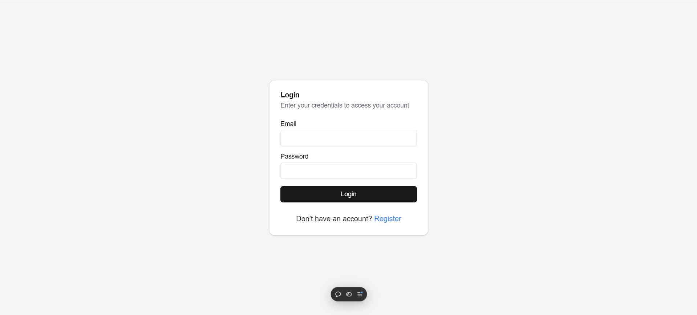

# AI Chatbot with Dashboard

This project is an AI-powered chatbot application with a user dashboard, built using Next.js, React, MongoDB and integrated with a Gemini AI backend.


# Live Website
[Live Website](https://ai-chat-bot007.vercel.app/)
## Table of Contents

- [Features](#features)
- [Prerequisites](#prerequisites)
- [Installation](#installation)
- [Usage](#usage)
- [Video Demonstration](#video-demonstration)
- [Functionality](#functionality)

## Features

- AI-powered chatbot using Gemini AI
- User authentication and authorization
- Real-time chat interface
- Chat history saving and retrieval
- Responsive design with mobile support
- Admin dashboard for user management and analytics

## Prerequisites

Before you begin, ensure you have met the following requirements:

- Node.js (v14.0.0 or later)
- npm (v6.0.0 or later)
- A Gemini AI API key

## Installation

1. Clone the repository:

   ```
   git clone https://github.com/ankit-dot/ai_chat-bot.git
   cd ai_chat-bot
   ```

2. Install the dependencies:

   ```
   npm install
   ```

3. Create a `.env.local` file in the root directory and add your Gemini AI API key:

   ```
   GEMINI_API=your_api_key_here
   ```

4. Set up your MongoDB connection string in the `.env.local` file:
   ```
   MONGODB_URI=your_mongodb_connection_string
   ```

## Usage

1. Start the development server:

   ```
   npm run dev
   ```

2. Open your browser and navigate to `http://localhost:3000`

3. Register a new account or log in with existing credentials

4. Start chatting with the AI or explore the dashboard features

## Video Demonstration

To see how to use this project, watch our video demonstration:

[](https://www.youtube.com/watch?v=VtDfkF7PF0A)

[Click here to watch the video](https://www.youtube.com/watch?v=VtDfkF7PF0A)

## Functionality

1. **User Authentication**

   - Register new accounts
   - Log in with existing credentials
   - Log out functionality

2. **Chat Interface**

   - Real-time chat with AI
   - Message history display
   

3. **Chat Management**

   - Create new chat sessions
   - Save chat history
   - Load previous chat sessions

4. **Dashboard**

   - View total users count
   - View total chats count
   - See active users in the last 24 hours
   - Calculate average chats per user

5. **User List**

   - Display all registered users
   - Show user details (email, role, chat count)
   - Search functionality for users

6. **Responsive Design**

   - Mobile-friendly interface
   - Collapsible sidebar for small screens

7. **Admin Features**

   - Access to user management (for admin roles)
   - View detailed analytics

8. **AI Integration**
   - Powered by Gemini AI
   - Handles various types of queries
   
